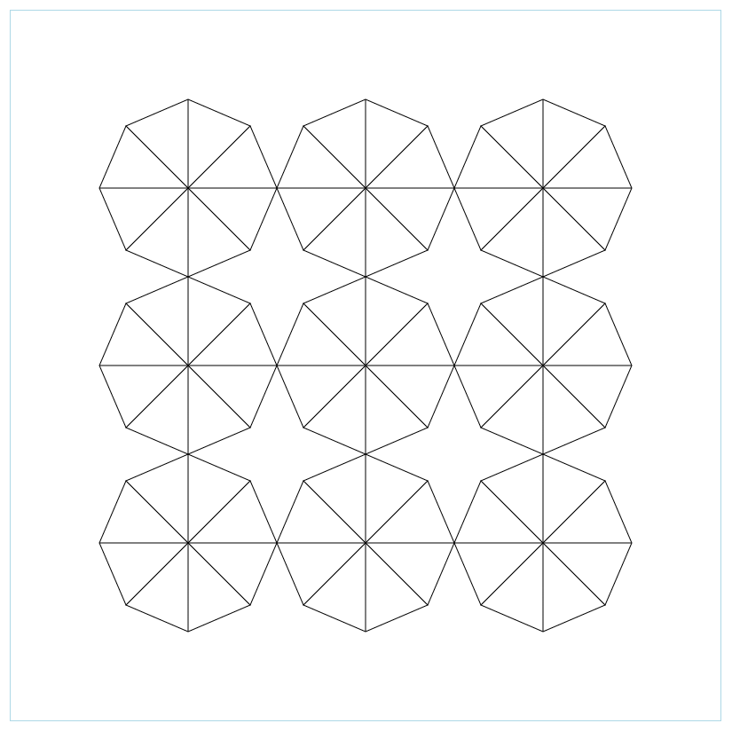

# canvas-patterns (cancan)
https://www.npmjs.com/package/canvas-patterns

## Simple pattern based canvas drawings

```
// Step 1: get the canvas element:
const canvasEl = document.querySelector('canvas#app')!;

// Step 2: instantiate Cancan:
const cancan = new Cancan(canvasEl as HTMLCanvasElement);

// Step 2: define and run your pattern:
// '.' - pen goes right
// '|' - pen goes down
// '-' - pen goes left
// '/' - pen goes up
// '4.' - short version for '....'
// (...) - pen moves w/o drawings
// [...] - pen draws right to the final sequence point
// `a4.5|10.20/A` - letter saves pen coorditates, corresponding upper case letter moves pen to the saved coordinates
// (any English letter can be used 'a' to 'z')

// Step 3: run your pattern:
cancan.go(100, 100, `3.3|3-3/`, opts); // square with 3 step sides (step is 10 pix by default)

// Options:
// color (string, default black) - line color
// thickness (number, default 1) - line width
// measure (boolean, default false) - if true then no drawings and go function returns measurements

// Centered drawing:
cancan.go('center', 'center', `3.3|3-3/`, opts);

// Patterns can be easoly combined since they are just strings.
// spaces and line breaks in a pattern are ignored:
const p = `x
10.a
(X)10|b
(X)10-c
(X)10/d
(X)[7.7|]e
(X)[7-7|]f
(X)[7-7/]g
(X)[7.7/]h
AEBFCGDH(X)
`;

// Utilities:
Cancan.turn(pattern) - turns pattern clockwise 90 grad
Cancan.turn2(pattern) - turns pattern clockwise 180 grad
Cancan.turn3(pattern) - turns pattern clockwise 270 grad
Cancan.mirrorX(pattern) - mirrors pattern horizontally
Cancan.mirrorY(pattern) - mirrors pattern vertically

```


